# KMZ upload & publish guide

For country administrators: how to add or refresh your country's WWFF / ONFF
area boundaries in Diana. This guide uses a real upload for Denmark (OZFF) to
show every screen exactly as it appears.

The whole process happens inside the Diana app itself, in its Administration
screen. You do not need to browse the GitHub website, open any code, or
understand how the app is built. The one exception is a single, one-time
setup step: creating your own personal access token on GitHub, covered in
section 2.

**Who this is for.** Anyone who has been asked to maintain their country's
area boundaries in Diana, typically one administrator per country. You do not
need to be a programmer, but you do need your own GitHub account.

**What you will do, in short:**

1. Open the Administration screen in Diana and fill in the repository details once.
2. Test the connection. This also loads the list of countries.
3. Pick your country and choose your KMZ file. Diana checks it before anything is uploaded.
4. Upload and convert: Diana does the technical work automatically.
5. Review the preview, then Publish (or Reject if something looks wrong).
6. Confirm the new data is live.

---

## 1. Prerequisites

Before your first upload, arrange the following once. You will not need to
repeat this for later uploads.

### 1.1 A GitHub account

Free, at github.com. If your country already has someone maintaining Diana,
ask them to invite your account as a collaborator on both repositories used
by Diana. If you are the first administrator for a new country, ask the
Diana maintainer to do this for you.

### 1.2 Your own personal access token

Diana needs permission to read and write to two GitHub repositories on your
behalf. Rather than using your GitHub password, you create a personal access
token: a long code that acts like a dedicated, limited key. Create your own;
do not reuse someone else's.

1. On GitHub, go to **Settings → Developer settings → Personal access tokens → Fine-grained tokens → Generate new token**.
2. Give it a name that identifies you personally, for example "Diana - Denmark - \<your name\>". If something ever needs to be traced back or revoked, a personal name makes that possible; a generic name like "Diana token" does not.
3. Set an expiration. Any period is fine; when it expires you simply generate a new token and paste it into the app again.
4. Under **Resource owner**, choose the diana-onff account.
5. Under **Repository access**, choose "Only select repositories" and select both `diana-onff.github.io` and `diana-source`.
6. Under **Repository permissions**, set the access levels below. Every permission not listed stays at its default (No access).

| Permission | Access level needed |
|---|---|
| Contents | Read and write |
| Pull requests | Read and write |
| Actions | Read and write |
| Issues | Read-only |
| Metadata | Read-only (selected automatically) |

7. Click **Generate token**. GitHub shows the token's value exactly once. Copy it immediately.

> **Treat it like a password.** Anyone with your token can act on Diana's
> repositories as you. Never share it, paste it anywhere else, or commit it
> to a file. If it ever leaks, revoke it on GitHub immediately and generate
> a new one.

### 1.3 Opening the Administration screen

In Diana, open Settings and tap the Diana logo five times in a row, or open
the app with `?admin=1` added to the web address. The **Admin** tab then
appears in the bottom navigation bar.

---

## 2. Field reference: repository setup

Fill this in once; the app remembers it on this device from then on (if you
tick "Remember the token").

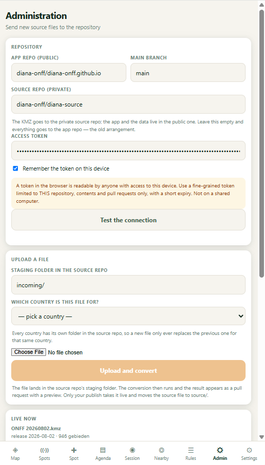

*The Administration screen: Repository card, Upload card, and Live now card.*

| Field | Example value | What it means |
|---|---|---|
| App repo (public) | `diana-onff/diana-onff.github.io` | The public repository that hosts the live app and its data. You will not need to open this yourself. |
| Main branch | `main` | The branch GitHub Pages publishes from. Leave this as main unless you have been told otherwise. |
| Source repo (private) | `diana-onff/diana-source` | Where original KMZ files are kept before and after conversion. Requires you to be a collaborator. |
| Access token | *(paste your token here)* | The personal access token you created in section 1.2. |
| Remember the token on this device | checkbox | Keeps the token in this browser only, so you do not have to paste it again next time. Nothing is sent to a server, as Settings itself says. |

---

## 3. Step-by-step: publishing a new release

### Step 1: Test the connection

Press "Test the connection" every time you start an upload session, even if
you uploaded before. It checks that your token can reach both repositories,
shows a green checkmark and the current branch for each, and, importantly,
this is also the step that loads the list of countries into the dropdown
below. Skipping it leaves that list empty.

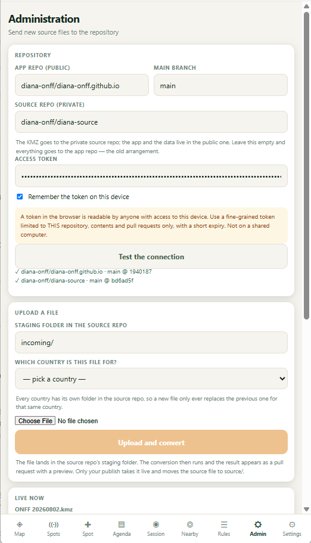

*Both repositories confirmed with a green checkmark after Test the connection.*

### Step 2: Choose your country

The country dropdown is grouped in two parts: "Already has boundaries in
Diana" for countries with existing area data, and "No boundaries yet" for a
country being added for the first time. Pick carefully: the wrong choice
here would put your file under someone else's country.

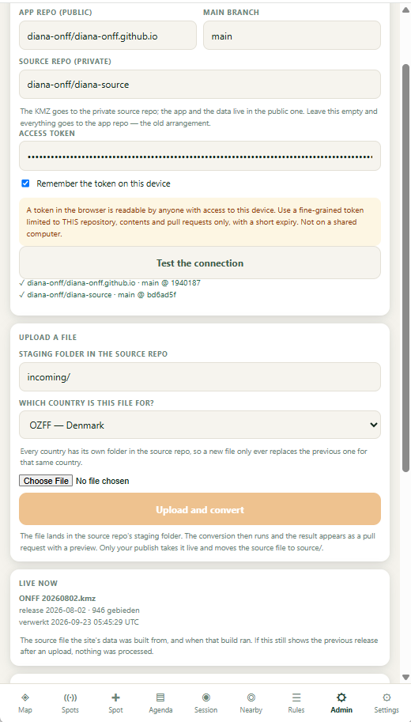

*Denmark (OZFF) selected. Once you publish a first release for a new
country, it moves automatically into "Already has boundaries."*

### Step 3: Choose your file

Use **Choose File** to select your KMZ from your computer. Diana then checks
the file in your browser, before anything is uploaded: it looks for area
references matching your chosen country and reports one of a few outcomes:
references found and matching (safe to continue), references from a
different country (wrong file), or no recognisable references at all. Only
continue once you see a confirmation for the right country.

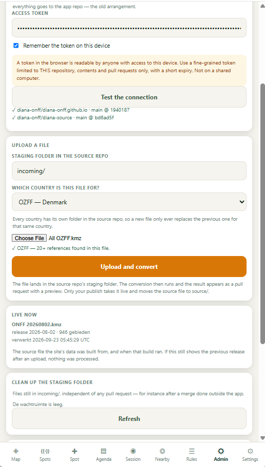

*File chosen and checked: references confirmed for the selected country,
Upload and convert now enabled.*

| Field | Value in this example | What it means |
|---|---|---|
| Staging folder in the source repo | `incoming/` | Fixed. Every upload always lands here first, before conversion. You cannot change this. |
| Which country is this file for? | Denmark (OZFF) | Must match the country whose boundaries are in the file. Every country has its own folder, so a new file always replaces only the previous one for that same country. |
| Choose File | `All OZFF.kmz` | Your exported KMZ. See the tip below about naming it. |

> **Tip: name your file with a date.** A filename such as "OZFF
> 20260923.kmz" lets Diana show a meaningful release date afterwards (in
> "Live now" and in Settings). A generic name such as "All OZFF.kmz" still
> uploads and works correctly, but the release date then shows as "?"
> because there is no date to read from the filename.

### Step 4: Upload and convert

Press **Upload and convert**. Diana now works through nine steps
automatically: reading the base branch, reading your file, sending it to
GitHub, updating the tree, creating the commit, writing to the staging
folder, starting the conversion, waiting for the conversion, and opening the
pull request. This typically takes one to a few minutes, and the screen
shows a checkmark next to each step as it completes.

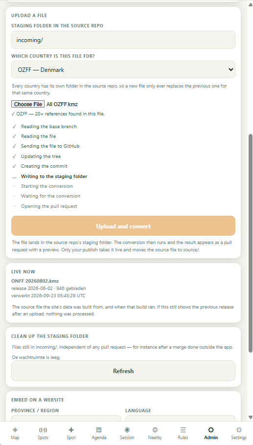

*Upload in progress: the KMZ has been written to the staging folder and
conversion has started.*

Do not close the tab while this runs. Nothing is public yet at this point:
the file only sits in a pull request with a preview, waiting for your
review.

### Step 5: Review the pending upload

Once the pull request is open, a "Pending upload" card appears with a link
to it and a diff report: how many areas the new file contains compared to
the current live data, how many are new, gone, or changed, and a cross-check
against the official WWFF directory (how many active references exist
there, how many now have a boundary, how many remain a point on the map).

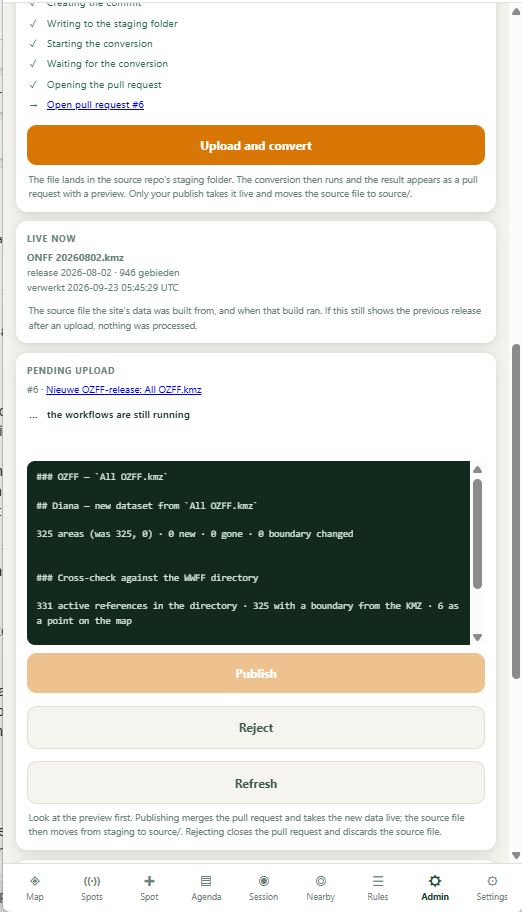

*Pending upload card with the diff report, right after the pull request opens.*

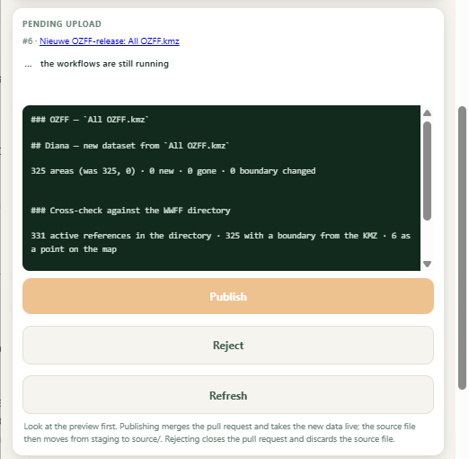

*The same card, scrolled to show the Publish, Reject and Refresh buttons.*

### Step 6: Wait for the checks, then look at the preview

The conversion and a preview build both need to finish before you should
publish. While that runs, the card shows "...the workflows are still
running." If this takes a long time, or you switch away to another tab or
app and come back, press **Refresh** to bring the status up to date:
browsers pause background timers on a tab that is not visible, so the card
can look stuck even once everything has actually finished.

Once every check has a green checkmark, an "Open the preview" link appears.
Open it and look at the result before deciding anything.

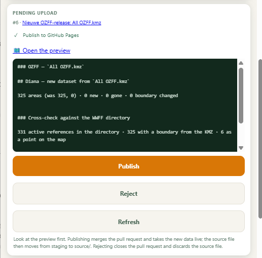

*All checks passed: the preview link is available and Publish is now enabled.*

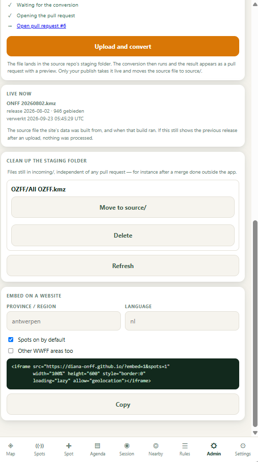

*Still waiting on a check: this is the moment to press Refresh if you have
been away from the tab.*

### Step 7: Publish, or Reject

**Publish** merges the pull request, takes the new data live, and moves your
source file from the staging folder to its permanent place. This is the
normal outcome once the preview looks right.

**Reject** closes the pull request and discards the uploaded file
completely, and nothing is left behind. Use it whenever the preview or the
diff numbers do not look right; you can then simply upload a corrected file.

> **Publishing is not easily undone.** Publish merges into the live site. If
> you are at all unsure, open the preview first, or ask before pressing
> Publish. Rejecting, by contrast, is completely safe and leaves nothing
> behind.

---

## 4. After publishing

Publishing succeeds the moment you see the confirmation message and the
Pending upload card disappears. Two places in the app, however, take a
little longer to catch up. This is expected, not a fault.

> **"Live now" does not refresh itself.** The Live now card is only read
> once, at the moment you open the Administration screen. Publishing does
> not update it on screen. Leave Admin and open it again (or reload the
> app) to see the new file, release and area count, and allow GitHub Pages
> a short moment, usually under a minute, to finish rebuilding the site
> before the new data actually appears.

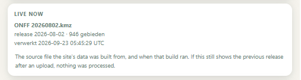

*Live now still shows the previous release, moments after Publish, before
the tab has been reloaded.*

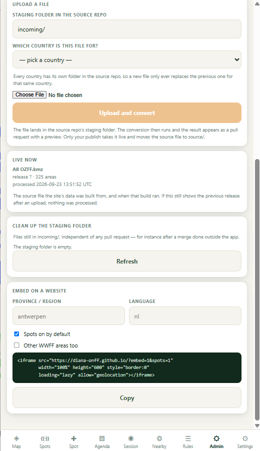

*The same card after reloading the app: the new file, its area count and
the build time are now correct.*

> **The country list in Settings behaves the same way.** On the Settings
> screen, the list of countries "with boundaries" is also loaded once, when
> the app starts. A country you just published will keep showing under
> "Points only," or with the old area count, until the app is reloaded.

---

## 5. Confirming your data is live

The clearest place to confirm a publish worked is Settings → Your country.
After reloading the app, select your country and check the area count: it
should match the diff report you reviewed before publishing.

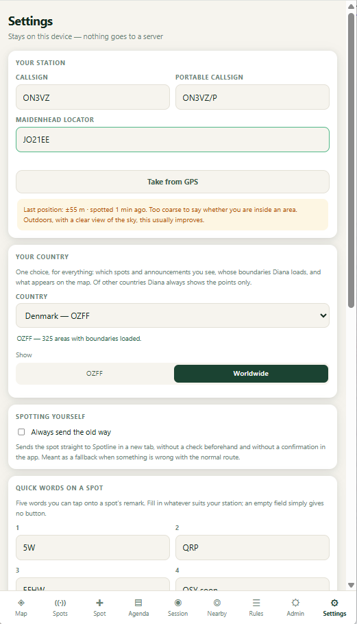

*Settings, Your country: Denmark (OZFF), 325 areas with boundaries loaded.*

The dropdown itself is grouped exactly like the one in Administration:
countries "With boundaries" at the top, everything else listed under
"Points only." A country moves from the second group into the first
automatically the first time its boundaries are published.

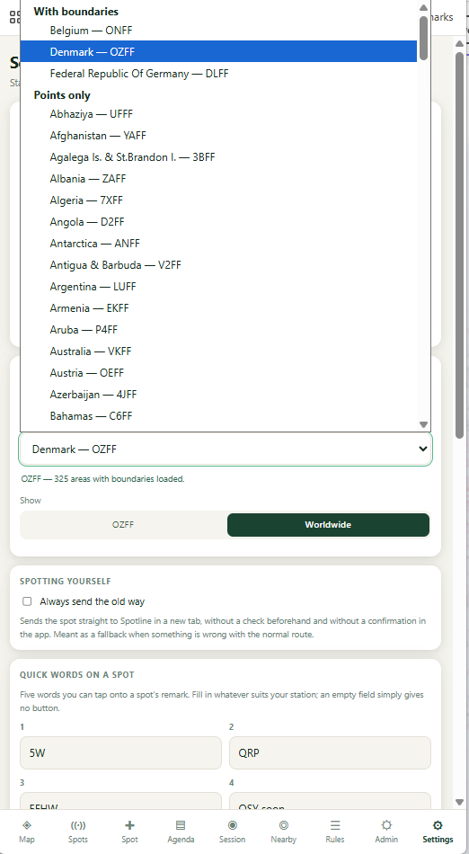

*The country dropdown expanded: Denmark now appears under "With
boundaries," alongside Belgium and Germany.*

---

## 6. Cleaning up the staging folder

For a normal upload (upload through the app, then Publish or Reject) you
never need to touch this card. Moving the file out of the staging folder
happens automatically the moment you press Publish or Reject.

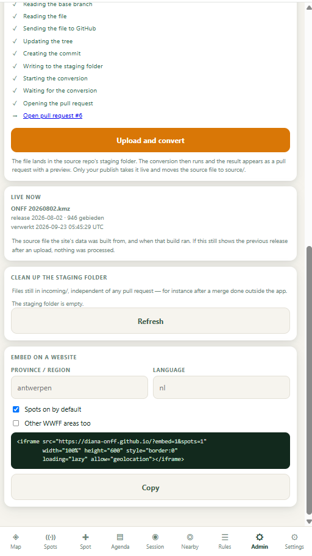

*After a normal Publish: the staging folder is confirmed empty.*

"Clean up the staging folder" exists as a fallback for files left behind
outside that normal flow, for example after a pull request was merged
directly on GitHub instead of through the app, or after switching devices or
clearing browser data, so Diana no longer recognises an upload it started.

| Button | When to use it | What it does |
|---|---|---|
| Move to source/ | An orphaned file is a valid release you want to keep. | Promotes it to `source/` manually, exactly as Publish would have. |
| Delete | An orphaned file should not be kept (a mistake, a duplicate, an old test). | Removes it from the staging folder for good. |
| Refresh | You are not sure the list is current, for instance right after an external change. | Re-reads the staging folder directly from GitHub. |

---

## 7. Tips & good practice

- Give every KMZ a name that includes a date (e.g. "OZFF 20260923.kmz"), so "Live now" and Settings both show a meaningful release date.
- Always press Test the connection at the start of a session: it is also what loads the country list.
- Trust the in-browser file check before uploading: it catches a wrong-country file before it ever reaches GitHub.
- Open the preview and read the diff numbers before publishing: new, gone and changed area counts, and the cross-check against the WWFF directory.
- After publishing, reload the app before judging whether it worked: both "Live now" and the Settings country list need a reload to catch up.
- Keep your access token private, and generate a new one from GitHub whenever it expires. No need to change anything else in the app.
- Everything described here happens inside Diana. You only ever need the GitHub website itself for the one-time token setup in section 1.
